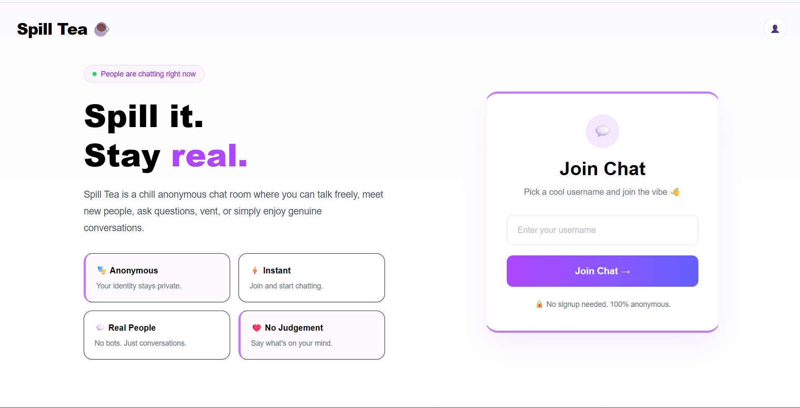
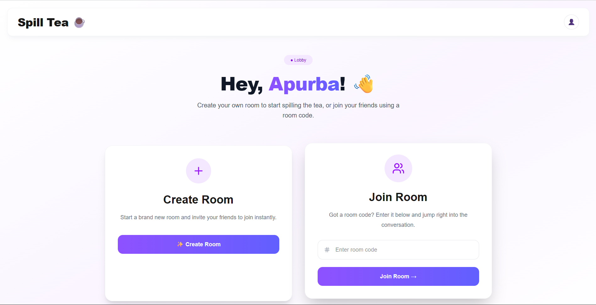
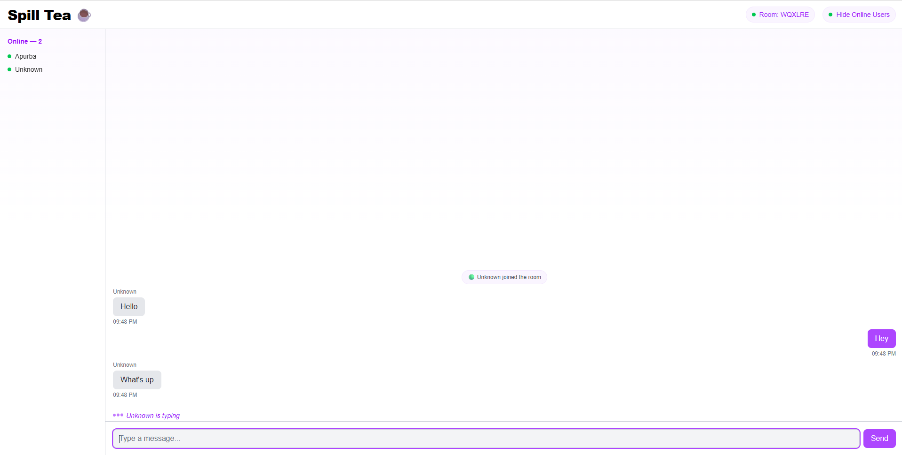

# ☕ Spill Tea

Real-time anonymous chat rooms — built with Socket.IO, Next.js 15, and TypeScript.

**🔗 Live demo:** [spill-tea-woad.vercel.app](https://spill-tea-woad.vercel.app/)




---

## What is this?

Spill Tea is a real-time, room-based chat app. Pick a username, create a room (or join one with a shareable code), and chat instantly with anyone in that room — messages, typing indicators, and live presence, all in real time, no signup or database required.

This project was built as a deliberate, feature-by-feature deep-dive into how real-time systems actually work — not generated in one shot, but built and understood one WebSocket event at a time.

---

## ✨ Features

- 🔌 **Real-time messaging** — instant delivery via WebSockets, no polling or refreshing
- 🏠 **Rooms with shareable codes** — create a room, share a 6-character code, friends join instantly
- 🟢 **Live presence** — see join/leave announcements and a live online users list, scoped per room
- ⌨️ **Typing indicators** — debounced "X is typing..." with animated dots
- 📋 **Copy-to-clipboard** room codes
- 📱 **Responsive design** — mobile-friendly layout, including a slide-in sidebar overlay on small screens
- 🎨 **Clean, cohesive UI** — built with Tailwind CSS, no component library

---

## 🛠️ Tech Stack

- **Next.js 15** (App Router)
- **TypeScript**
- **Socket.IO** (client + server)
- **Tailwind CSS**
- **React Hooks** (no external state management library)
- No database — all state lives in memory on the server

---

## 🏗️ Architecture

This project runs as **two separate processes**, not a single Next.js app:

```
client/   →  Next.js frontend (deployed on Vercel)
server/   →  Standalone Socket.IO server (deployed on Render)
```

**Why two processes, not one?**

Next.js (App Router) is built around short-lived, serverless-style request/response handling. Socket.IO needs the opposite: a persistent, long-running Node process that keeps WebSocket connections open and holds in-memory state (which rooms exist, who's in them) for as long as the server is alive.

Rather than fighting Next.js's execution model with a custom server hack, this project keeps the two concerns fully separate:

- The **client** only ever talks to the Socket.IO server over WebSockets — it has no server-side logic of its own.
- The **server** is a plain Node + Express + Socket.IO app, deployable anywhere that supports persistent processes (Render, Railway, Fly.io — notably *not* Vercel, which doesn't support long-running servers).

This mirrors how real-world chat/realtime systems are often architected: a dedicated realtime service, separate from the main web app.

---

## 🚀 Local Setup

Clone the repo:

```bash
git clone https://github.com/apurbahalderr/SPILL-TEA.git
cd SPILL-TEA
```

### 1. Start the server

```bash
cd server
npm install
npm run dev
```

Server runs on `http://localhost:4000`.

### 2. Start the client (in a separate terminal)

```bash
cd client
npm install
npm run dev
```

Client runs on `http://localhost:3000`.

### Environment variables

**`server/.env`**
```
CLIENT_URL=http://localhost:3000
```

**`client/.env.local`**
```
NEXT_PUBLIC_SOCKET_URL=http://localhost:4000
```

See `.env.example` in each folder for reference.

---

## 📦 Deployment

- **Client** → deployed on [Vercel](https://vercel.com) (Root Directory: `client`)
- **Server** → deployed on [Render](https://render.com) (Root Directory: `server`, Build: `npm install && npm run build`, Start: `npm start`)

Both services are configured via environment variables (`NEXT_PUBLIC_SOCKET_URL` on the client, `CLIENT_URL` on the server) so CORS and socket connections resolve correctly in production without touching source code.

---

## 🧠 What I learned building this

This project was built specifically to deeply understand real-time systems, not just use them. Some of what stuck:

- **Event-driven programming** — thinking in terms of `emit`/`on` rather than call/return
- **Broadcast scoping** — the real difference between `io.emit`, `socket.broadcast.emit`, and their room-scoped equivalents (`io.to()`, `socket.to()`), and how using the wrong one silently breaks features
- **Closures** — how event handlers keep access to component state across re-renders
- **`useRef` vs `useState`** — and why timer IDs belong in a ref, not state
- **Debouncing** — building a real typing indicator with a cancel-and-restart timer pattern
- **TypeScript discriminated unions** — safely handling multiple event shapes (`ChatMessage` vs `SystemMessage`) in one array without unsafe casts
- **Race conditions** — debugging real timing bugs between server broadcasts and client component mount order
- **CORS in production** — the difference between `localhost` dev CORS and configuring it correctly across two separately-deployed services

---

## 🗺️ Future improvements

These were deliberately left out of scope to keep the focus on real-time systems, not backend/auth infrastructure:

- [ ] Persistent chat history (would require a database — currently everything is in-memory and resets on server restart)
- [ ] User accounts / authentication
- [ ] Message reactions / replies
- [ ] Dark mode
- [ ] Room passwords / private rooms

---

## 👤 Author

**Apurba Halder**
- GitHub: [@apurbahalderr](https://github.com/apurbahalderr)
- LinkedIn: [Apurba Halder](https://www.linkedin.com/in/apurba-halder-457a81319/)

---

## 📄 License

MIT — see [LICENSE](./LICENSE) for details.
